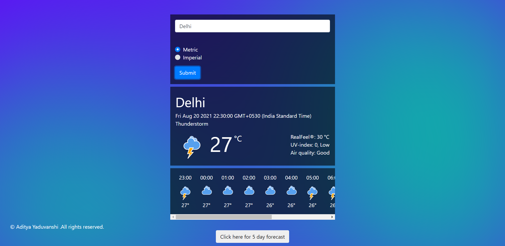
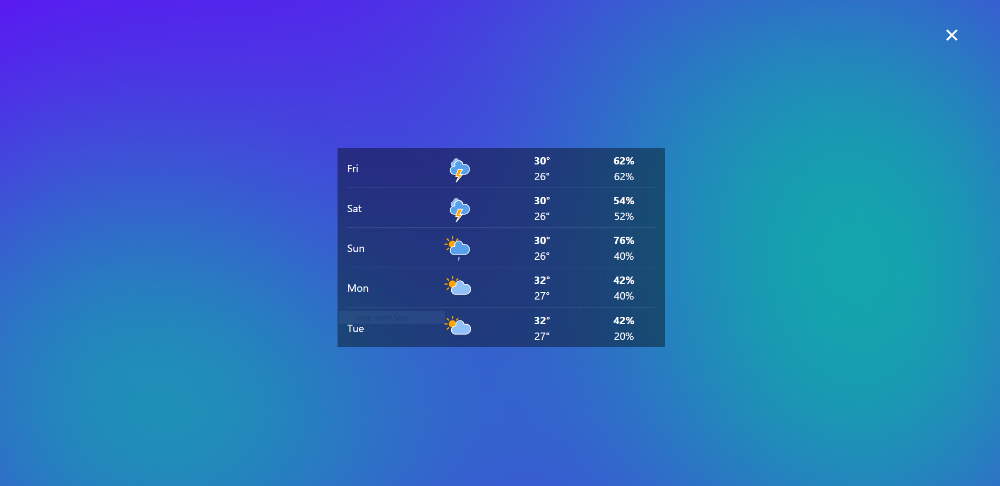

# Weather App
Weather app with 5 days forecast using Accuweather Api.

## About the project
Description: It is a weather app as a JavaScript project which gives user to see today's weather conditon,temperature,time,date etc.I have used Accuweather API in this project.This project is also responsive page.

## Link to website
   Live Demo - https://weatherapp-addy.netlify.app/

## Screenshots

  
  
## Contact me
<ul>
  <li>Created by Aditya Yaduvanshi</li>
  <li>Twitter -- <a href="https://twitter.com/fixslyr">Fixslyr</a>
    <li>Instagram -- <a href="https://www.instagram.com/imtheaddy/">Aditya Yaduvanshi</a>
      <li>Linkedin -- <a href="https://www.linkedin.com/in/theaditya-yaduvanshi-/">Aditya Yaduvanshi</a>
  </ul>    
